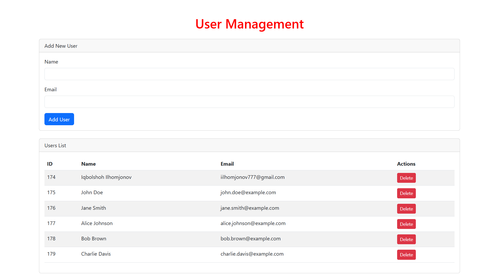

# 📌 PHP Database Manager

🚀 This project, developed by **Iqbolshoh Ilhomjonov**, is a simple and secure PHP database wrapper class that uses MySQLi for database interactions. It provides an easy-to-use interface for executing queries, fetching results, and managing transactions efficiently.



## ✨ Features
- 🔒 **Secure MySQLi connection**
- ⚡ **Supports prepared statements**
- 📊 **Fetch results as an associative array or object**
- 🔄 **Transaction management (begin, commit, rollback)**
- ❌ **Error handling with exceptions**
- 🛠️ **Convenient helper methods for inserting, updating, and deleting data**

## 📥 Installation
You can clone the repository from GitHub:
```sh
 git clone https://github.com/Iqbolshoh/php-database-manager.git
```
Or simply include the `Database.php` file in your project and create an instance of the `Database` class.

## 🛠️ Usage

### 1️⃣ Initialize the Database
```php
require_once 'Database.php';
$db = new Database();
```

### 2️⃣ Running Queries

#### 🔍 Select Data
```php
$users = $db->query("SELECT * FROM users WHERE email = ?", ['iilhomjonov777@gmail.com']);
print_r($users);
```

#### ➕ Insert Data
```php
$db->query("INSERT INTO users (name, email) VALUES (?, ?)", ['Iqbolshoh Ilhomjonov', 'iilhomjonov777@gmail.com']);
```

#### ✏️ Update Data
```php
$db->query("UPDATE users SET email = ? WHERE id = ?", ['iqbolshoh123@gmail.com', 3]);
```

#### ❌ Delete Data
```php
$db->query("DELETE FROM users WHERE id = ?", [3]);
```

### 3️⃣ Transactions
```php
$db->beginTransaction();
try {
    $db->query("UPDATE accounts SET balance = balance - ? WHERE id = ?", [100, 1]);
    $db->query("UPDATE accounts SET balance = balance + ? WHERE id = ?", [100, 2]);
    $db->commit();
} catch (Exception $e) {
    $db->rollback();
    echo "Transaction failed: " . $e->getMessage();
}
```

## 🚨 Error Handling
If an error occurs, an exception will be thrown. You can catch it like this:
```php
try {
    $db->query("SELECT * FROM nonexistent_table");
} catch (Exception $e) {
    echo "Database error: " . $e->getMessage();
}
```

## 🖥 Technologies Used
<div style="display: flex; flex-wrap: wrap; gap: 5px;">
    
    
    
    
    
</div>

## 📜 License
This project is open-source and available under the **MIT License**.

## 🤝 Contributing  
🎯 Contributions are welcome! If you have suggestions or want to enhance the project, feel free to fork the repository and submit a pull request.

## 📬 Connect with Me  
💬 I love meeting new people and discussing tech, business, and creative ideas. Let’s connect! You can reach me on these platforms:

<div align="center">
  <table>
    <tr>
      <td>
        <a href="https://iqbolshoh.uz" target="_blank">
          
        </a>
      </td>
      <td>
        <a href="mailto:iilhomjonov777@gmail.com" target="_blank">
          
        </a>
      </td>
      <td>
        <a href="https://github.com/iqbolshoh" target="_blank">
          
        </a>
      </td>
      <td>
        <a href="https://www.linkedin.com/in/iqbolshoh/" target="_blank">
          
        </a>
      </td>
      <td>
        <a href="https://t.me/iqbolshoh_777" target="_blank">
          
        </a>
      </td>
      <td>
        <a href="https://wa.me/998997799333" target="_blank">
          
        </a>
      </td>
      <td>
        <a href="https://instagram.com/iqbolshoh_777" target="_blank">
          
        </a>
      </td>
      <td>
        <a href="https://x.com/iqbolshoh_777" target="_blank">
          
        </a>
      </td>
      <td>
        <a href="https://www.youtube.com/@Iqbolshoh_777" target="_blank">
          
        </a>
      </td>
    </tr>
  </table>
</div>
